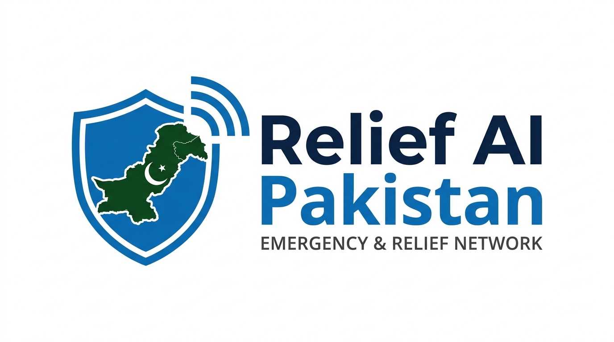

<div align="center">



# Relief AI Pakistan

**AI-powered emergency guidance, helplines and safety tools for Pakistan.**

*When every second matters, know what to do.*

[Live Demo](#) · [Demo Video](#) · [Report a Bug](../../issues)

</div>

> Built for a hackathon. Resource listings, alerts and map data in this repository are **sample data for demonstration**, not live or officially verified information. In a real emergency, call **1122** (Rescue) or **115** (Edhi).

---

## Overview

During floods, earthquakes, fires and other disasters, people do not have time to search the web or read long articles. **Relief AI Pakistan** puts the essentials in one simple, mobile-friendly web app: step-by-step emergency guides, one-tap helplines, an AI assistant that understands **English, Urdu and Roman Urdu**, and tools to prepare before a disaster happens.

## Features

| Section | What it does |
|---|---|
| **Emergency Guide** | Quick actions for earthquakes, fires and gas leaks, medical emergencies, landslides, severe weather and heatwaves, road accidents, and general crisis triage. Each guide shows what to do now, what to avoid, and the right helpline with a tap-to-call button. |
| **AI Assistant** | Describe what happened in English, Urdu or Roman Urdu. The app detects the emergency type and urgency, then returns clear do and don't steps, a one-tap call to the right helpline, and shortcuts to Trapped Mode and shelters. |
| **Live Alerts** | An advisories panel (monsoon rain, river flows, highway landslides). Currently sample data. |
| **Find Shelters** | Browse shelters, hospitals, Rescue 1122 stations, relief camps and police by city, with call buttons and Google Maps links. Optional location access. |
| **Family Safety** | Register family contacts and copy a ready-made status update to share. |
| **Go-Bag Kit** | Interactive emergency kit checklist with a progress bar and a Must Have counter. |
| **Test Offline** | Previews an offline mode showing essential helplines and guides. This is a simulation; the app does not yet ship a service worker. |
| **Emergency Help (Trapped Mode)** | Large, simple actions for someone who is trapped: location capture, an SOS whistle sound to signal rescuers, a copyable emergency message with location, and quick calls to 1122 and 115. |
| **Multilingual UI** | Language switcher for English, Urdu and Roman Urdu. |

## How the AI works

1. **Local triage engine (instant, no network).** `analyzeEmergencyText()` in `src/services/emergencyAI.ts` matches keywords in English, Urdu and Roman Urdu (for example "pani", "zalzala", "phans gaya") to an emergency category and urgency level, and returns vetted do and don't steps.
2. **Gemini enhancement (optional).** If an API key is configured, `getEmergencyAiResponse()` asks Google Gemini for a short, tailored response using the detected category as context. If the call fails or no key is set, the app falls back to the local triage result, so the assistant always answers.

## Tech stack

- [React 19](https://react.dev/) + [TypeScript](https://www.typescriptlang.org/)
- [Vite](https://vite.dev/)
- [Tailwind CSS v4](https://tailwindcss.com/)
- [`@google/genai`](https://www.npmjs.com/package/@google/genai) (Google Gemini SDK)
- [`motion`](https://motion.dev/) for animation and [`lucide-react`](https://lucide.dev/) for icons

## Getting started

### Prerequisites

- Node.js 20 or newer
- npm

### Install and run

```bash
git clone https://github.com/<your-username>/relief-ai-pakistan.git
cd relief-ai-pakistan
npm install
npm run dev
```

The dev server runs at <http://localhost:3000>.

> **Install error about peer dependencies?** This project includes an `.npmrc` with `legacy-peer-deps=true` to avoid a peer dependency conflict between Vite and its plugins. If you don't have it, create a file named `.npmrc` containing that line, or run `npm install --legacy-peer-deps`.

### Environment variables (optional)

The app works without any key, using the local triage engine only. To enable Gemini responses:

```bash
cp .env.example .env
```

then set:

```env
VITE_GEMINI_API_KEY="your-key-here"
```

> **Security warning:** Vite embeds any `VITE_*` variable into the public JavaScript bundle, so anyone can read the key from the deployed site. For a demo, use a throwaway key with a low quota and delete it afterwards. For production, move the Gemini call into a server-side function (for example a Vercel or Netlify function) that holds the key as a secret.

The Gemini model name is set in `src/services/emergencyAI.ts`. Check it against the current list of Gemini models if you see only fallback responses.

### Scripts

| Command | Description |
|---|---|
| `npm run dev` | Start the dev server on port 3000 |
| `npm run build` | Production build into `dist/` |
| `npm run preview` | Preview the production build locally |
| `npm run lint` | Type-check with `tsc --noEmit` |

## Project structure

```
.
├── public/
│   ├── brand/                  # Logo
│   └── images/                 # Hero and section images
├── src/
│   ├── components/
│   │   ├── Navbar.tsx
│   │   ├── HeroSection.tsx
│   │   ├── PakistanStatusBanner.tsx     # Live Alerts
│   │   ├── EmergencyQuickActions.tsx    # Emergency Guide
│   │   ├── UniversalEmergencyModal.tsx  # Guide details
│   │   ├── AiAssistantSection.tsx       # AI chat
│   │   ├── NearbyHelpMap.tsx            # Find Shelters
│   │   ├── FamilySafetySection.tsx
│   │   ├── EmergencyKitSection.tsx      # Go-Bag Kit
│   │   ├── TrappedEmergencyMode.tsx
│   │   ├── OfflineModal.tsx
│   │   └── Footer.tsx
│   ├── data/pakistanEmergencyData.ts    # Helplines, guides, resources, alerts
│   ├── services/emergencyAI.ts          # Local triage + Gemini call
│   ├── types/index.ts
│   ├── App.tsx
│   └── main.tsx
├── .env.example
├── index.html
├── package.json
└── vite.config.ts
```

## Key helplines in the app

| Service | Number |
|---|---|
| Rescue 1122 | 1122 |
| Edhi Emergency | 115 |
| Police | 15 |
| Chhipa Ambulance | 1020 |
| Fire Brigade | 16 |
| Motorway Police | 130 |
| Red Crescent | 1030 |
| NDMA Crisis Cell | 051-111-157-157 |

Coverage varies by area (for example, Rescue 1122 does not operate in every district). Confirm numbers for your location.

## Deployment

This is a static Vite site. On Vercel or Netlify, import the repository and use:

- **Build command:** `npm run build`
- **Output directory:** `dist`

## Known limitations and roadmap

- Alerts, shelter and hospital listings, and timestamps are hardcoded sample data.
- The map is a simplified visual with Google Maps links, not a real GIS map.
- Offline mode is a simulation; a service worker is needed for true offline support.
- The Gemini key is client-side. Move it behind a server-side function before any production use.
- Planned: official NDMA and PMD feeds, verified and regularly refreshed resource data, a real map, and a service worker for offline use.

## Disclaimer

Relief AI Pakistan provides general safety information and is **not** a substitute for professional emergency services. AI-generated guidance can be incomplete or wrong. Always call your local emergency number first.

## Contributing

Issues and pull requests are welcome. For major changes, please open an issue first to discuss what you would like to change.

